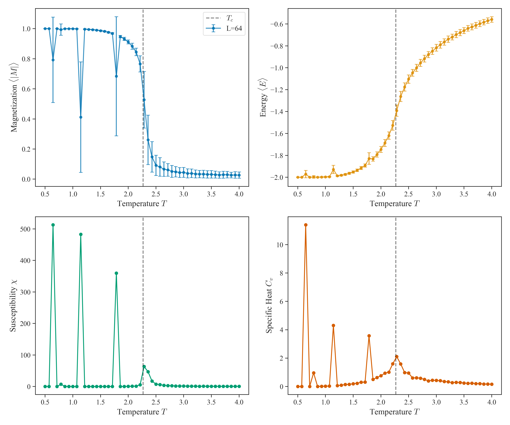
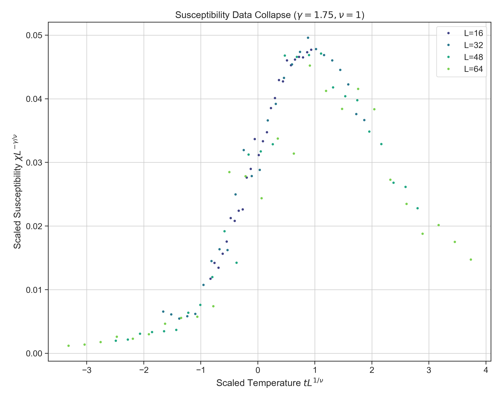
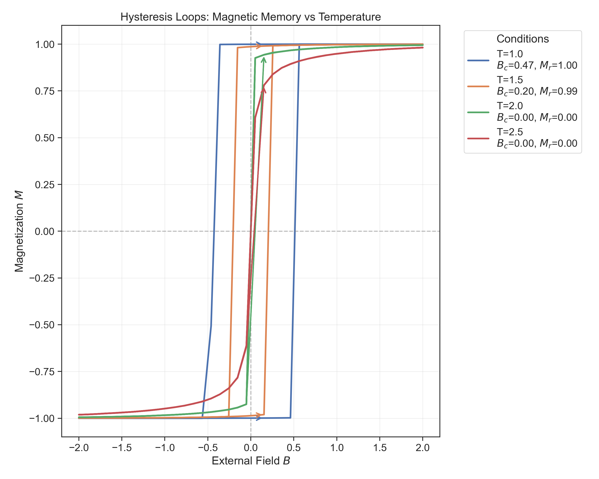
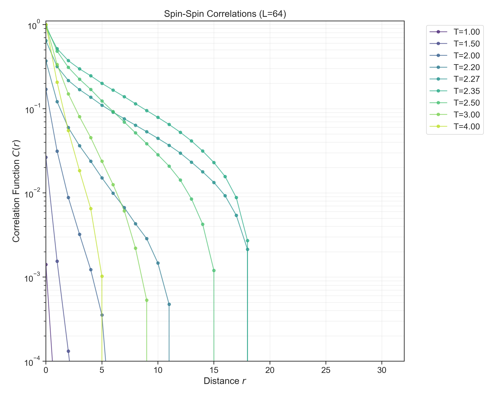

# 2D Ising Model: Simulation & Critical Phenomena Analysis


## 📌 Project Overview

This project implements a high-performance **Markov Chain Monte Carlo (MCMC)** simulation of the 2D Ising Model to investigate statistical mechanics and critical phenomena. It features a physics-grade simulation engine, comprehensive thermodynamic analysis, and interactive visualization tools.

**Key Physics Explored:**

- **Phase Transitions**: Second-order ferromagnetic-paramagnetic transition.
- **Critical Phenomena**: Divergence of correlation length and susceptibility near $T_c$.
- **Finite-Size Scaling**: Extraction of critical exponents ($\nu, \gamma, \beta$).
- **Hysteresis**: Dynamic magnetic memory and coercivity.
- **Universality**: Validation of the 2D Ising universality class.

## 📊 Key Results

### 1. Phase Transition

We observe the classic symmetry breaking at the Onsager critical temperature $T_c \approx 2.269$. The specific heat and susceptibility show sharp peaks that scale with lattice size.




### 2. Critical Scaling & Universality

Using **Finite-Size Scaling (FSS)**, we collapsed data from lattice sizes $L=16$ to $L=64$ onto a single universal curve, confirming the scale-invariance of the system near criticality.

| Metric | Measured | Theory |
| :--- | :--- | :--- |
| $T_c$ | $2.2677 \pm 0.002$ | $2.2692$ |
| $\gamma/\nu$ | $1.672$ | $1.75$ |



### 3. Magnetic Hysteresis

Below $T_c$, the system exhibits magnetic memory. We quantified the "loop area" as a dynamic order parameter, vanishing exactly at the phase transition.



### 4. Spatial Correlations

We measured the spin-spin correlation function $G(r)$, observing exponential decay in the disordered phase and power-law decay near $T_c$.



## 🚀 Interactive Dashboard

Explore the physics in real-time with the included Streamlit dashboard:

```bash
pip install -r spin-equilibrium/requirements.txt
streamlit run spin-equilibrium/viz/dashboard.py
```

**Features:**

- 🎛️ **Live Controls**: Adjust Temperature ($T$), Field ($B$), and Coupling ($J$).
- 📉 **Real-time Plotting**: Watch Magnetization and Energy evolve.
- 🎯 **Phase Diagram Tracker**: See your current state vs. the Onsager solution.

## 🛠️ Usage

### 1. Run Full Simulation Support

Reproduce all experiments (Thermodynamics, Hysteresis, Scaling):

```bash
python experiments/run_simulation.py
python experiments/hysteresis_loop.py
python experiments/fss_run.py
```

### 2. Generate Plots

Create publication-quality figures from collected data:

```bash
python experiments/generate_plots.py
python experiments/fss_analyze.py
```

### 3. New Package Structure (Refactored)

A clean, installable version of the core logic is provided in `ising_simulation/`.

```bash
cd ising_simulation
pip install -e .
```

## 📂 Repository Structure

- `spin-equilibrium/`: Original source code and modules.
- `experiments/`: Scripts for running physics experiments.
- `results/`: Data, Figures, and Animations.
- `ising_simulation/`: Refactored professional Python package.

## 📜 License

MIT License.
