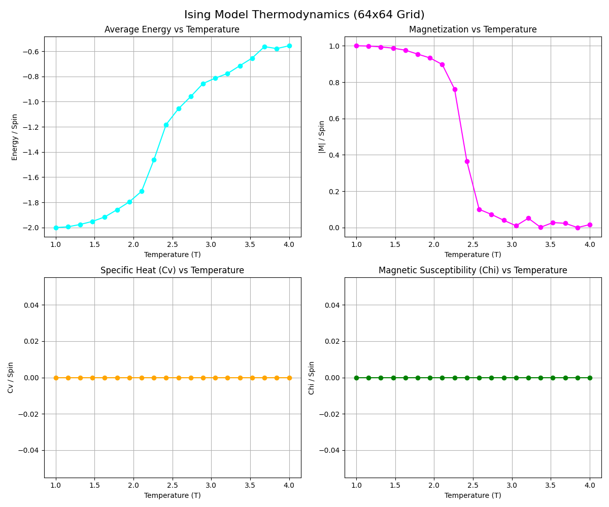

# 🌌 Phy-AI Bridge: From Spin Networks to Neural Manifolds

> **Author**: Yehia Said Gewily  
> **Institution**: Alexandria University  
> **Research Focus**: Statistical Mechanics, Energy-Based Models (EBMs), Neuromorphic Computing  

This repository documents a multi-phase research project exploring the foundational isomorphism (mathematical equivalence) between **Statistical Mechanics** and **Artificial Intelligence**. Inspired by the foundational work of Hopfield and Boltzmann (and the context of the 2024 Nobel Prize in Physics), this project investigates how local physical interactions give rise to global emergent intelligence.

The goal is to move beyond "black box" deep learning by building AI architectures from the ground up, starting with their physical roots in thermodynamics.

---

## 📌 Phase 1: Spin Equilibrium (The Ising Foundation)

In this phase, we implemented a high-performance computational simulation of the **2D Ising Model**. This serves as the "Physical Baseline" for understanding Energy-Based Models (EBMs).

**The Core Concept**: In physics, systems evolve to minimize a **Hamiltonian ($H$)**; in AI, models optimize to minimize a **Loss Function ($L$)**. These are fundamentally the same mathematical operation.

### 1. Theoretical Framework: The Canonical Ensemble

We model the system as a lattice $\Lambda$ of spins $\sigma \in \{+1, -1\}$. The probability of the system existing in a specific configuration is governed by the Boltzmann Distribution:

$$ P(\mathbf{\sigma}) = \frac{1}{\mathcal{Z}} e^{-\beta H(\mathbf{\sigma})} $$

Where $\beta = \frac{1}{k_B T}$ is the inverse temperature and $\mathcal{Z}$ is the partition function.

The energy landscape is defined by the Hamiltonian:
$$ H(\mathbf{\sigma}) = -J \sum_{\langle i,j \rangle} \sigma_i \sigma_j - B \sum_{i} \sigma_i $$

* **Interaction Term ($-J \sum \sigma_i \sigma_j$)**: Represents the "weights" in a neural network. If $J>0$ (Ferromagnetic), spins effectively "vote" to align with their neighbors.
* **External Field ($-B \sum \sigma_i$)**: Represents the "bias" or input signal in a neural network.

### 2. High-Performance Computational Implementation

Simulating large-scale statistical systems requires significant computational power. Standard iterative approaches ($O(N)$) are insufficient for real-time visualization.

#### ⚡ Vectorized Checkerboard Decomposition

To achieve a simulation speed of **60+ FPS** on a $256 \times 256$ grid (65,536 agents), we implemented a **Vectorized Metropolis-Hastings Algorithm** using NumPy.

We exploit the conditional independence of the square lattice. By decomposing the grid into **Red (Even)** and **Black (Odd)** sub-lattices, we can update half the grid simultaneously without race conditions.

```python
# Vectorized Update Logic (from core/ising_model.py)
# 1. Calculate local field for entire parity group
dE = 2 * grid * (J * neighbors + B)

# 2. Vectorized Decision Mask (Metropolis Criterion)
# Case A: Energy Decreases (Greedy) -> Flip
# Case B: Energy Increases (Thermal) -> Flip with prob exp(-dE/T)
flip_mask = (random_probs < np.exp(-dE / T)) & parity_mask

# 3. Parallel State Update
grid[flip_mask] *= -1
```

### 3. Thermodynamic Analysis & Critical Phenomena

We conducted automated experiments across a temperature range $T \in [1.0, 4.0]$ to verify the **Second-Order Phase Transition**.

#### The Order Parameter: Magnetization ($M$)

$$ M = \frac{1}{N} \sum_i \sigma_i $$
Our data confirms the "Magnetization Cliff" at the critical temperature $T_c \approx 2.269$. Below this point, the system exhibits spontaneous symmetry breaking, "choosing" a global state (All-Up or All-Down) effectively acting as a memory unit.

#### Response Functions (Variance Tracking)

We implemented real-time tracking of thermodynamic fluctuations to calculate second-order derivatives of the Free Energy:

**Specific Heat Capacity ($C_v$)**:
$$ C_v = \frac{\text{Var}(E)}{T^2} $$
*Observation*: A sharp divergence (peak) in $C_v$ at $T_c$, indicating the system absorbs maximum energy to randomize the ordered domains.

**Magnetic Susceptibility ($\chi$)**:
$$ \chi = \frac{\text{Var}(M)}{T} $$
*Observation*: Massive "Critical Opalescence" near $T_c$. The system becomes hypersensitive to external perturbations (The "Edge of Chaos"), which is theoretically optimal for information processing in neural networks.

---

## 📊 Visual Evidence

The `results/` directory contains visual proof of the simulation's fidelity.

### Thermodynamic Curves


*Figure 1: Quantitative analysis showing the phase transition. Note the sharp drop in Magnetization (Magenta) and the singularity in Susceptibility (Green) at $T \approx 2.3$.*

### Lattice Evolution

| High Temp (Paramagnetic) | Critical Temp (Scale Invariant) | Low Temp (Ferromagnetic) |
|:---:|:---:|:---:|
| $T=4.0$ (Noise) | $T \approx 2.27$ (Fractal Clusters) | $T=1.0$ (Ordered Domain) |

---

## 🚀 Future Work: Phase 2 - The Bridge (Hopfield Networks)

The next stage of this research involves transitioning from **fixed physical constants** to **learnable parameters**.

We will replace the scalar interaction constant $J$ with a weight matrix $W_{ij}$ derived from the **Hebbian Learning Rule**:
$$ W_{ij} = \frac{1}{N} \sum_{\mu} \xi_i^{\mu} \xi_j^{\mu} $$

This transformation will convert our Ising lattice into a functional **Hopfield Network**, capable of storing complex patterns (associative memory) rather than just ferromagnetic order.

---

## 🛠️ Tech Stack

* **Core Physics**: Python 3.10+, NumPy (Vectorized Linear Algebra)
* **Visualization**: Pygame (Surface Array Blitting), Matplotlib (Agg Backend for Real-time Plotting)
* **Environment**: Google Antigravity (Agentic IDE)
* **Documentation**: LaTeX / Markdown

---

## 📚 Citation

If you use this work for research or academic purposes, please cite the attached Technical Report:

```bibtex
@techreport{gewily2025ising,
  author = {Yehia Said Gewily},
  title = {Computational Simulation of Critical Phenomena in the 2D Ising Model},
  institution = {Alexandria University},
  year = {2025},
  note = {Phase 1: Spin-Equilibrium Implementation}
}
```
