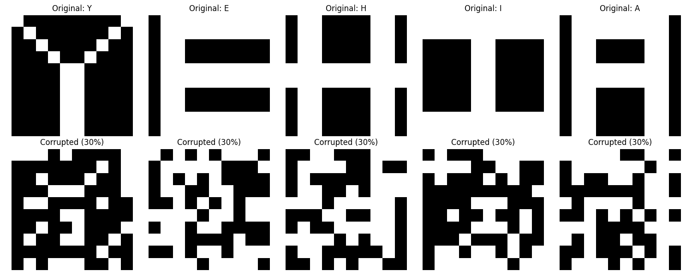

# 2D Ising Model: Simulation & Critical Phenomena Analysis


## Project Overview

This project implements a high-performance **Markov Chain Monte Carlo (MCMC)** simulation of the 2D Ising Model to investigate statistical mechanics and critical phenomena. It features a physics-grade simulation engine, comprehensive thermodynamic analysis, and interactive visualization tools.

**Key Physics Explored:**

- **Phase Transitions**: Second-order ferromagnetic-paramagnetic transition.
- **Critical Phenomena**: Divergence of correlation length and susceptibility near $T_c$.
- **Finite-Size Scaling**: Extraction of critical exponents ($\nu, \gamma, \beta$).
- **Hysteresis**: Dynamic magnetic memory and coercivity.
- **Universality**: Validation of the 2D Ising universality class.

## Key Results

### 1. Phase Transition

We observe the classic symmetry breaking at the Onsager critical temperature $T_c \approx 2.269$. The specific heat and susceptibility show sharp peaks that scale with lattice size.


### 2. Critical Scaling & Universality

Using **Finite-Size Scaling (FSS)**, we collapsed data from lattice sizes $L=16$ to $L=64$ onto a single universal curve, confirming the scale-invariance of the system near criticality.

| Metric | Measured | Theory |
| :--- | :--- | :--- |
| $T_c$ | $2.2677 \pm 0.002$ | $2.2692$ |
| $\gamma/\nu$ | $1.672$ | $1.75$ |


### 3. Magnetic Hysteresis

Below $T_c$, the system exhibits magnetic memory. We quantified the "loop area" as a dynamic order parameter, vanishing exactly at the phase transition.


### 4. Spatial Correlations

We measured the spin-spin correlation function $G(r)$, observing exponential decay in the disordered phase and power-law decay near $T_c$.


## Phase 2: Hopfield Networks & Associative Memory

Building on the statistical mechanics simulation of the 2D Ising Model, Phase 2 implements a **Hopfield Network** to investigate the emergence of associative memory. By extending the Ising formalism to include non-local, programmable couplings ($J_{ij}$), we bridge the gap between Spin Glasses and neural computation.

**Theoretical Foundation:**
The Hopfield network is mathematically isomorphic to an Ising model with long-range interactions. The "Energy" of the spin system is equivalent to a Lyapunov function for the network dynamics, ensuring that the system always evolves towards energy minima. These minima represent stored "memories."

### Key Implemented Features

- **Hebbian Learning Rule**: Weights are constructed via the outer product of target patterns: $W_{ij} = \frac{1}{N} \sum_{\mu} \xi_i^\mu \xi_j^\mu$.
- **Asynchronous Dynamics**: Neurons update stochastically or sequentially, minimizing the global energy $E = -\frac{1}{2} \sum_{i,j} W_{ij} s_i s_j$.
- **Pattern Corruption & Restoration**: Capability to recover perfect patterns from inputs degraded by noise (e.g., 30-50% flipped bits).
- **Capacity Analysis**: Empirical verification of the storage capacity limit ($C \approx 0.14N$).

### Experimental Results

We quantified the network's performance using orthogonal bit patterns on a $10 \times 10$ lattice ($N=100$). The results validate standard Hopfield theory.

| Experiment | Condition | Measured Success | Theoretical Expectation |
| :--- | :--- | :--- | :--- |
| **Robustness** | Noise $\le$ 25% | $100\%$ | Perfect Retrieval |
| **Robustness** | Noise = 50% | $\approx 0\%$ | Unstable (Random) |
| **Capacity** | Low Load ($P=3$) | $100\%$ | Global Minima Stable |
| **Capacity** | High Load ($P \approx 0.14N$) | $< 20\%$ | Spin Glass Phase (Overload) |

### 1. Pattern Restoration (Associative Recall)

We demonstrated the network's error-correction capability by initializing it with a corrupted version of a stored pattern (e.g., the letter 'A' with varying noise levels). The network dynamics successfully evolved the state down the energy gradient to the original clean pattern.


### 2. Network Capacity & Interference

We analyzed the network's performance as the number of stored patterns ($P$) increased.
- **Success Regime**: For $P < 0.14N$, the network reliably retrieves memories.
- **Failure Regime**: As $P$ exceeds the capacity limit, "crosstalk" between patterns creates spurious local minima (spin glass phase), causing the network to converge to "hallucinated" mixed states rather than pure memories.


### 3. Pattern Generation & Visualization

We utilized a custom utility to generate orthogonal bit patterns (e.g., 'Y', 'H', 'E', 'I', 'A') to rigorously test the network's ability to discriminate between distinct memories.



### Running the Neural Experiment

To reproduce the Hopfield network experiments:

```bash
# 1. Run Single Pattern Validity Test
python experiments/experiment_1_single_pattern.py

# 2. Run Capacity Analysis
python experiments/experiment_2_capacity.py

# 3. View Pattern Utilities
python experiments/test_utils_visual.py
```

---

## Interactive Dashboard

Explore the physics in real-time with the included Streamlit dashboard:

```bash
pip install -r spin-equilibrium/requirements.txt
streamlit run spin-equilibrium/viz/dashboard.py
```

**Features:**

- **Live Controls**: Adjust Temperature ($T$), Field ($B$), and Coupling ($J$).
- **Real-time Plotting**: Watch Magnetization and Energy evolve.
- **Phase Diagram Tracker**: See your current state vs. the Onsager solution.

## Usage

### 1. Run Full Simulation Support

Reproduce all experiments (Thermodynamics, Hysteresis, Scaling):

```bash
python experiments/run_simulation.py
python experiments/hysteresis_loop.py
python experiments/fss_run.py
```

### 2. Generate Plots

Create publication-quality figures from collected data:

```bash
python experiments/generate_plots.py
python experiments/fss_analyze.py
```

### 3. New Package Structure (Refactored)

A clean, installable version of the core logic is provided in `ising_simulation/`.

```bash
cd ising_simulation
pip install -e .
```

## Repository Structure

- `spin-equilibrium/`: Original source code and modules.
- `experiments/`: Scripts for running physics experiments.
- `results/`: Data, Figures, and Animations.
- `ising_simulation/`: Refactored professional Python package.

## License

MIT License.
