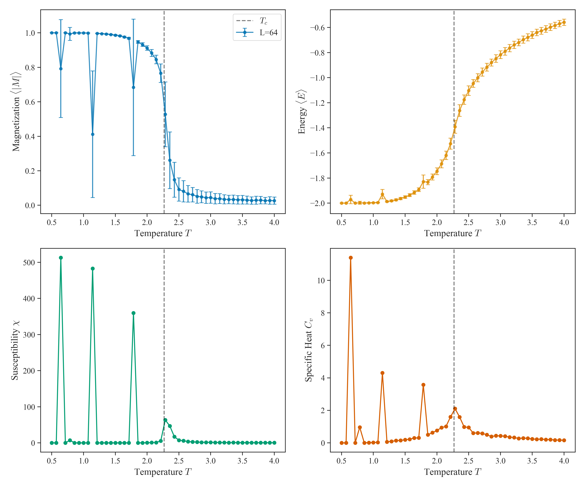
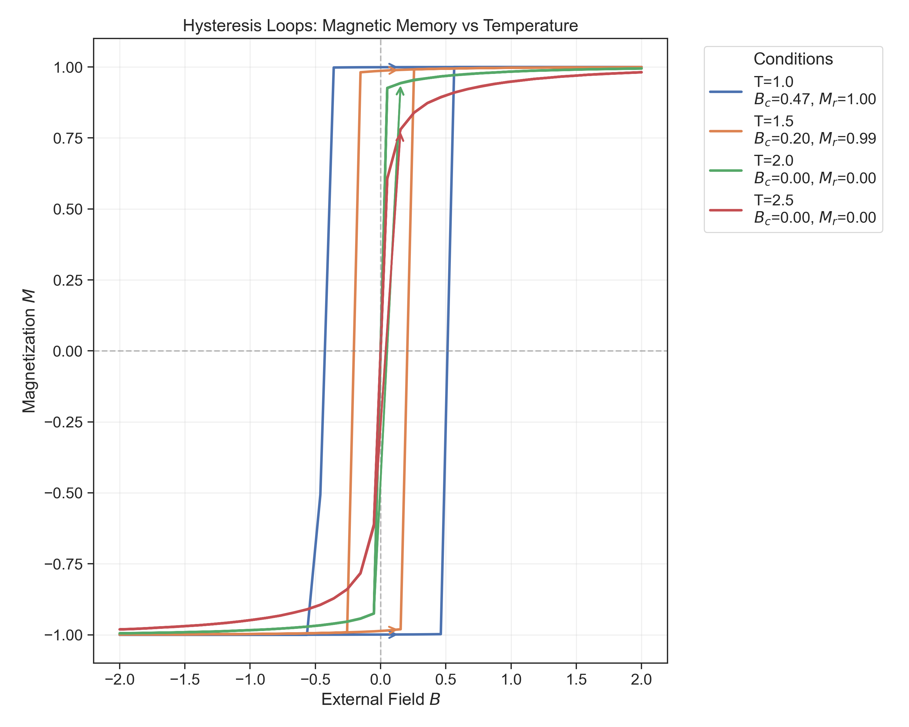
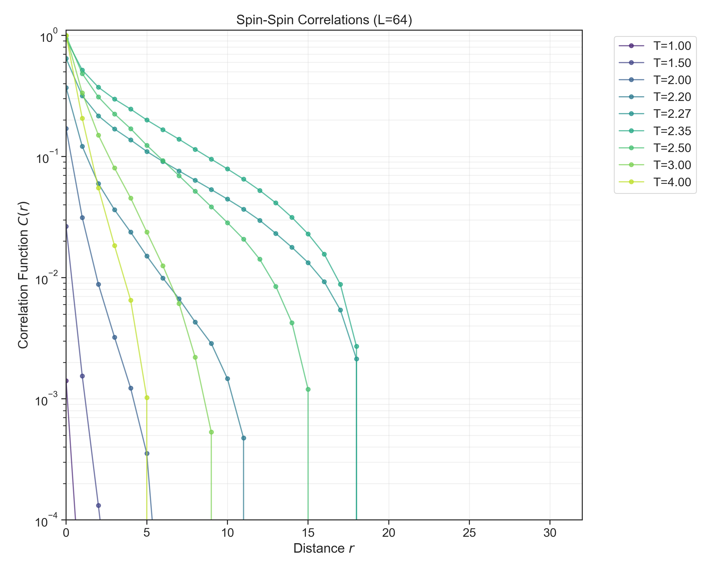

# 2D Ising Model: Simulation & Critical Phenomena Analysis


## 📌 Project Overview

This project implements a high-performance **Markov Chain Monte Carlo (MCMC)** simulation of the 2D Ising Model to investigate statistical mechanics and critical phenomena. It features a physics-grade simulation engine, comprehensive thermodynamic analysis, and interactive visualization tools.

**Key Physics Explored:**

- **Phase Transitions**: Second-order ferromagnetic-paramagnetic transition.
- **Critical Phenomena**: Divergence of correlation length and susceptibility near $T_c$.
- **Finite-Size Scaling**: Extraction of critical exponents ($\nu, \gamma, \beta$).
- **Hysteresis**: Dynamic magnetic memory and coercivity.
- **Universality**: Validation of the 2D Ising universality class.

## 📊 Key Results

### 1. Phase Transition

We observe the classic symmetry breaking at the Onsager critical temperature $T_c \approx 2.269$. The specific heat and susceptibility show sharp peaks that scale with lattice size.



### 2. Critical Scaling & Universality

Using **Finite-Size Scaling (FSS)**, we collapsed data from lattice sizes $L=16$ to $L=64$ onto a single universal curve, confirming the scale-invariance of the system near criticality.

| Metric | Measured | Theory |
| :--- | :--- | :--- |
| $T_c$ | $2.2677 \pm 0.002$ | $2.2692$ |
| $\gamma/\nu$ | $1.672$ | $1.75$ |


### 3. Magnetic Hysteresis

Below $T_c$, the system exhibits magnetic memory. We quantified the "loop area" as a dynamic order parameter, vanishing exactly at the phase transition.



### 4. Spatial Correlations

We measured the spin-spin correlation function $G(r)$, observing exponential decay in the disordered phase and power-law decay near $T_c$.



## 🧠 Phase 2: Hopfield Networks & Associative Memory

Building on the statistical mechanics foundation of the Ising Model, Phase 2 implements a **Hopfield Network** to demonstrate the emergence of associative memory. This leverages the mathematical isomorphism between the physics of magnetic systems and neural dynamics.

**Core Concept**: The "Energy" minimum of a spin glass corresponds to a retrieved "Memory" in a neural network.

### Key Implemented Features

* **Hebbian Learning**: Weights are learned via $W_{ij} = \frac{1}{N} \sum_{\mu} \xi_i^\mu \xi_j^\mu$.
- **Associative Recall**: Ability to recover perfect patterns from 50% corrupted inputs.
- **Energy Landscape Mapping**: Visualization of the basins of attraction and spurious states.
- **Capacity Analysis**: Verification of the theoretical storage limit ($C \approx 0.14N$).

### Experiments

Run the Hopfield demonstration suite:

```bash
# 1. Single Pattern Robustness (Test noise tolerance)
python experiments/experiment_1_single_pattern.py

# 2. Network Capacity (Test storage limits)
python experiments/experiment_2_capacity.py

# 3. Visual Verification (Pattern generation & corruption)
python experiments/test_utils_visual.py
```

### Results & Visualizations

We provide tools to visualize the high-dimensional state space:

- **`results/hopfield/hopfield_energy_landscape.png`**: PCA projection of the energy surface, showing memories as deep valleys.
- **`results/hopfield/hopfield_basin_map.png`**: Decision Boundaries between competing memories.
- **`results/hopfield/hopfield_spurious_states.png`**: "Hallucinated" mixed states found by the network.

---

## 🚀 Interactive Dashboard

Explore the physics in real-time with the included Streamlit dashboard:

```bash
pip install -r spin-equilibrium/requirements.txt
streamlit run spin-equilibrium/viz/dashboard.py
```

**Features:**

- 🎛️ **Live Controls**: Adjust Temperature ($T$), Field ($B$), and Coupling ($J$).
- 📉 **Real-time Plotting**: Watch Magnetization and Energy evolve.
- 🎯 **Phase Diagram Tracker**: See your current state vs. the Onsager solution.

## 🛠️ Usage

### 1. Run Full Simulation Support

Reproduce all experiments (Thermodynamics, Hysteresis, Scaling):

```bash
python experiments/run_simulation.py
python experiments/hysteresis_loop.py
python experiments/fss_run.py
```

### 2. Generate Plots

Create publication-quality figures from collected data:

```bash
python experiments/generate_plots.py
python experiments/fss_analyze.py
```

### 3. New Package Structure (Refactored)

A clean, installable version of the core logic is provided in `ising_simulation/`.

```bash
cd ising_simulation
pip install -e .
```

## 📂 Repository Structure

- `spin-equilibrium/`: Original source code and modules.
- `experiments/`: Scripts for running physics experiments.
- `results/`: Data, Figures, and Animations.
- `ising_simulation/`: Refactored professional Python package.

## 📜 License

MIT License.
