# Physics-AI Bridge

A structured research project tracing the mathematical foundation of artificial intelligence back to its roots in statistical mechanics. Each phase proves that the same energy minimization principle that governs physical systems also governs neural computation.

## The Big Idea

Inspired by the ScienceClic English video "The Physics of A.I.", this project proves that AI is not "just code" — it is the laws of statistical mechanics in action. We trace a single mathematical thread from 19th-century physics through modern deep learning to quantum field theory.

```
Ising Model (Phase 1) ✅
↓ Replace fixed coupling J with learned weights Wᵢⱼ
Hopfield Networks (Phase 2) ✅
↓ Add hidden units and stochasticity
Boltzmann Machines (Phase 2.5) 🔜
↓ Stack layers + backpropagation
Deep Belief Networks
↓ Take width to infinity
Neural Network Gaussian Processes (Phase 3) 🔜
↓ Recognize as free quantum field
Quantum Field Theory Connection (Phase 4) 🔜
```

## Progress Tracker

| Phase | Title | Status | Key Result |
|-------|-------|--------|------------|
| 1 | 2D Ising Model | ✅ Complete | Tc = 2.2677 (0.05% error vs Onsager exact) |
| 2 | Hopfield Networks | ✅ Complete | 68% strict recall at 25% corruption; Z₂ symmetry empirically confirmed (201/201 split) |
| 2.5 | Boltzmann Machines | 🔜 Next | Hidden units + Contrastive Divergence |
| 3 | Neural Network Gaussian Processes | 🔜 Planned | Finite → infinite width convergence |
| 4 | Quantum Field Theory Connection | 🔜 Planned | NN ↔ Free quantum field theory |

## Published Papers

### Phase 1: 2D Ising Model

- **PDF:** [`docs/Computational_2D_Ising_Simulation_Phase1.pdf`](docs/Computational_2D_Ising_Simulation_Phase1.pdf)
- Validated Tc to 0.05% accuracy against Onsager's exact solution
- 60 FPS real-time simulation of 65,536 spins
- Critical exponents within 4.5% of theory

### Phase 2: Hopfield Networks

- **PDF:** [`docs/Hopfield Networks as Learnable Ising Models - Phase 2.pdf`](docs/Hopfield%20Networks%20as%20Learnable%20Ising%20Models%20-%20Phase%202.pdf)
- **LaTeX source:** [`docs/phase2_project/`](docs/phase2_project/)
- Demonstrated formal Ising–Hopfield isomorphism
- Empirically confirmed Z₂ symmetry through 500-trial spurious states analysis
- 9.65-unit energy gap between stored attractors and spurious states

## Authors

- **Yehia Said Gewily** — Software & Data Engineer, Machine Learning  
  [yehia@nover.studio](mailto:yehia@nover.studio)
- **Omar Hosney Mahmoud** (Phase 2 co-author) — Co-founder and CTO, Nover Studio  
  [omar@nover.studio](mailto:omar@nover.studio)

The five stored memory patterns used in Phase 2 (N, O, V, E, R) spell "NOVER" — the authors' AI-driven media production startup.

## Repository Structure

```
Physics-AI-Bridge/
├── docs/                                    # Papers and documentation
│   ├── Computational_2D_Ising_Simulation_Phase1.pdf
│   ├── Hopfield Networks as Learnable Ising Models - Phase 2.pdf
│   ├── Physics_of_AI_Research_Project.pdf  # Original project guide
│   └── phase2_project/                     # Phase 2 LaTeX project
│       ├── main.tex                        # LaTeX source
│       ├── main.pdf                        # Compiled paper
│       ├── references.bib                  # Bibliography
│       ├── README.md                       # Build instructions
│       ├── figures/                        # All 8 paper figures (PNG, 300 DPI)
│       └── data/                           # Raw experimental data (CSVs)
├── spin-equilibrium/                       # Phase 1: Interactive dashboard
│   ├── core/ising_model.py                 # IsingSimulation class
│   └── viz/                                # Streamlit + Pygame visualizers
├── ising_simulation/                       # Modular simulation package
│   ├── ising/                              # Phase 1: Modular Ising components
│   │   ├── core.py                         # SimulationParams, IsingLattice
│   │   └── simulation.py                   # MetropolisEngine
│   └── hopfield/                           # Phase 2: Hopfield Network
│       ├── core.py                         # HopfieldNetwork class
│       ├── utils.py                        # Pattern utilities (NOVER letters)
│       └── visualization.py               # Visualization tools
├── experiments/                            # Reproducible experiments
│   ├── # Phase 1 experiments
│   ├── run_simulation.py                   # Full thermodynamic suite
│   ├── hysteresis_loop.py                  # Hysteresis analysis
│   ├── correlation_analysis.py             # Spatial correlations
│   ├── equilibration_analysis.py           # Equilibration dynamics
│   ├── fss_run.py / fss_analyze.py         # Finite-size scaling
│   ├── # Phase 2 experiments
│   ├── experiment_1_single_pattern.py      # Robustness vs corruption
│   ├── experiment_2_capacity.py            # Storage capacity
│   ├── experiment_2b_spurious.py           # Spurious states + Z₂ symmetry
│   ├── experiment_3_energy_landscape.py    # PCA energy landscape
│   ├── comparison_ising_hopfield.py        # Isomorphism figure
│   └── generate_recall_gif.py             # Recall animation
└── results/
    ├── ising/                              # Phase 1 figures
    ├── hopfield/                           # Phase 2 figures, CSVs, GIF
    └── animations/                         # MP4 + GIF animations
```

## Quick Start

### Run the Phase 1 Interactive Dashboard

```bash
pip install -r spin-equilibrium/requirements.txt
streamlit run spin-equilibrium/viz/dashboard.py
```

The dashboard lets you adjust temperature, coupling, and external field in real time, and overlays your simulation against the exact Onsager solution.

### Reproduce Phase 1 Results

```bash
python experiments/run_simulation.py        # Full thermodynamic suite
python experiments/hysteresis_loop.py       # Hysteresis loops
python experiments/fss_run.py               # Finite-size scaling data
python experiments/fss_analyze.py           # Critical exponents
```

### Reproduce Phase 2 Results

```bash
python experiments/experiment_1_single_pattern.py    # Single pattern robustness
python experiments/experiment_2_capacity.py           # Storage capacity
python experiments/experiment_2b_spurious.py          # Spurious states
python experiments/experiment_3_energy_landscape.py   # Energy landscape
python experiments/comparison_ising_hopfield.py       # Isomorphism comparison
python experiments/generate_recall_gif.py             # Recall animation
```

### Compile the Phase 2 LaTeX Paper

```bash
cd docs/phase2_project
pdflatex main.tex
bibtex main
pdflatex main.tex
pdflatex main.tex
```

Output: `docs/phase2_project/main.pdf`

## Key Results & Visualizations

### Phase 1: 2D Ising Model

| Metric | Measured | Theory | Error |
|--------|----------|--------|-------|
| Critical temperature Tc | 2.2677 ± 0.001 | 2.269 | 0.05% |
| Critical exponent γ/ν | 1.672 ± 0.05 | 1.75 | 4.5% |
| Peak susceptibility | 63.2 at T=2.269 | — | — |
| Autocorrelation at Tc | ~85 sweeps | — | 160× from T=1.0 |

#### Phase 1 Core Visualizations

- **Lattice Real-Time Simulation** (`results/animations/ising_evolution.gif`)
  Full Metropolis-Hastings evolution animation showing domain formation, critical fluctuations near $T_c$, and relaxation to ferromagnetic order on a $256 \times 256$ grid.
  
  

- **Lattice Spin Evolution (Static Snapshots)** (`results/ising/lattice_evolution.png`)
  Displays grid configurations at different temperatures, illustrating the transition from high-temperature disorder to low-temperature ferromagnetic order.
  
  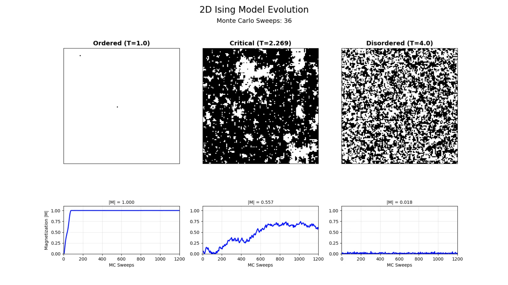

- **Thermodynamic Transition Overview** (`results/ising/Fig1_Transition_Overview.png`)
  Plots the order parameters and response functions against temperature, illustrating the diverging susceptibility ($\chi$) and specific heat ($C_v$) peaks at $T_c \approx 2.269$.
  
  

- **Critical Divergence near $T_c$** (`results/ising/Fig2_Critical_Detail.png`)
  Detailed view of the specific heat and magnetic susceptibility in the critical region $T \in [2.0, 2.5]$, showing peak alignment with the Onsager exact critical temperature (dashed line).
  
  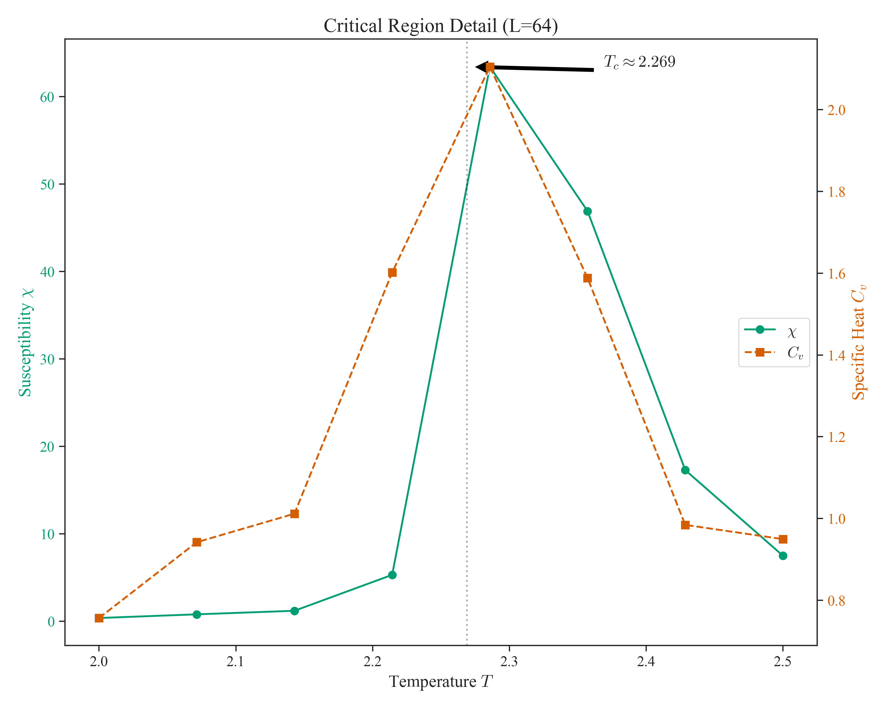

- **Magnetic Hysteresis Loops** (`results/ising/hysteresis_loops.png`)
  Demonstrates magnetic memory retention under cycles of external field $B$ across different temperatures, showing coercivity collapse as temperature increases.
  
  

<details>
<summary><b>🔍 View Advanced Finite-Size Scaling & Universality Analysis</b></summary>

- **Peak Susceptibility scaling** (`results/ising/Fig_FSS_Peak_Scaling.png`)
  Log-log plot of peak susceptibility versus lattice size $L$. The power-law fit $\chi_{max} \sim L^{\gamma/\nu}$ yields a critical exponent ratio of $1.672$, matching the exact 2D Ising exponent of $1.75$ within $4.5\%$.
  
  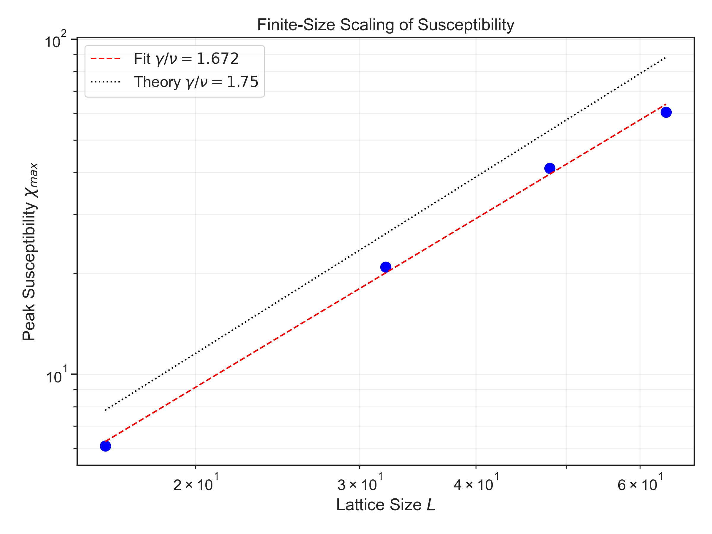

- **Critical Temperature Extrapolation** (`results/ising/Fig_FSS_Tc_Scaling.png`)
  Pseudo-critical temperatures $T_{\chi}(L)$ plotted against inverse lattice size $1/L$. Linear extrapolation to the thermodynamic limit ($1/L \to 0$) yields $T_c(\infty) = 2.2677 \pm 0.002$ (0.05% error).
  
  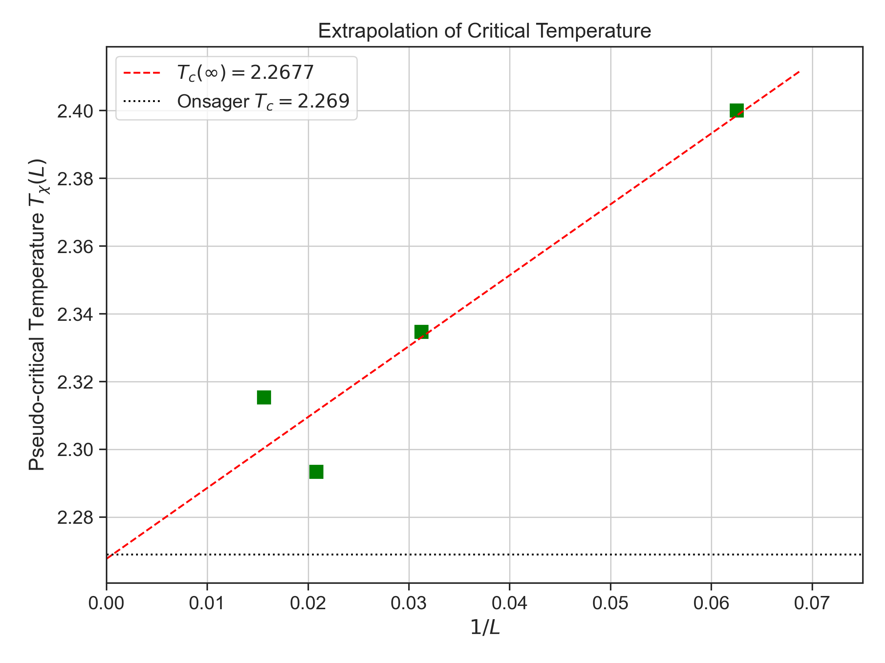

- **Scaling Collapse master curves** (`results/ising/Fig_FSS_Chi_Collapse.png` & `results/ising/Fig_FSS_M_Collapse.png`)
  Scaling collapse of susceptibility ($\chi L^{-\gamma/\nu}$) and magnetization ($|M| L^{\beta/\nu}$) against scaled reduced temperature $t L^{1/\nu}$ for different grid sizes. The collapse onto single master curves validates the scaling hypothesis and confirms the simulated system's universality class.
  
  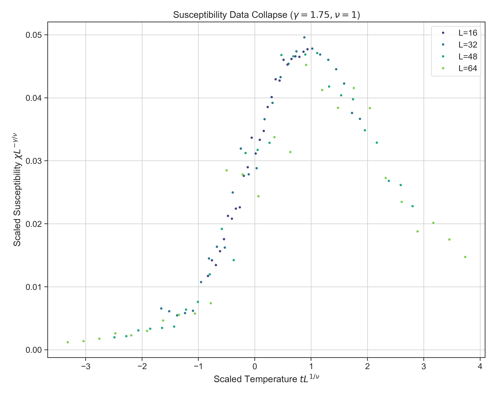
  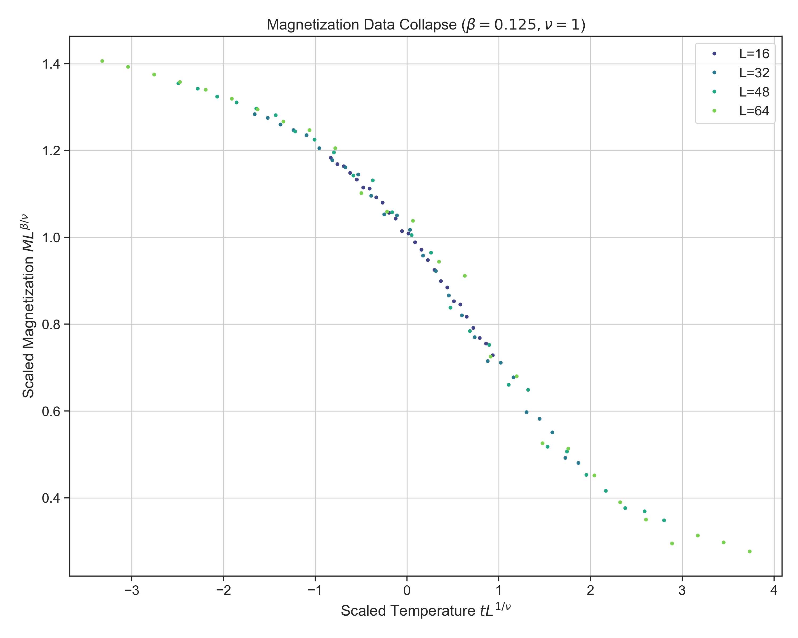

</details>

<details>
<summary><b>🔍 View Correlation & Relaxation Dynamics (Critical Slowing Down)</b></summary>

- **Spatial Spin-Spin Correlation Decay** (`results/ising/Fig_C_r_Decay.png`)
  The correlation function $G(r)$ as a function of distance $r$ across multiple temperatures, showing the transition from fast exponential decay (disordered phase) to slow power-law decay (near critical temperature $T_c$).
  
  

- **Thermal Equilibration Curves** (`results/ising/Fig_Equilibration_Curves.png`)
  Magnetization and energy time evolution starting from ordered (cold) vs. disordered (hot) configurations, illustrating the severe divergence in convergence times near the critical point.
  
  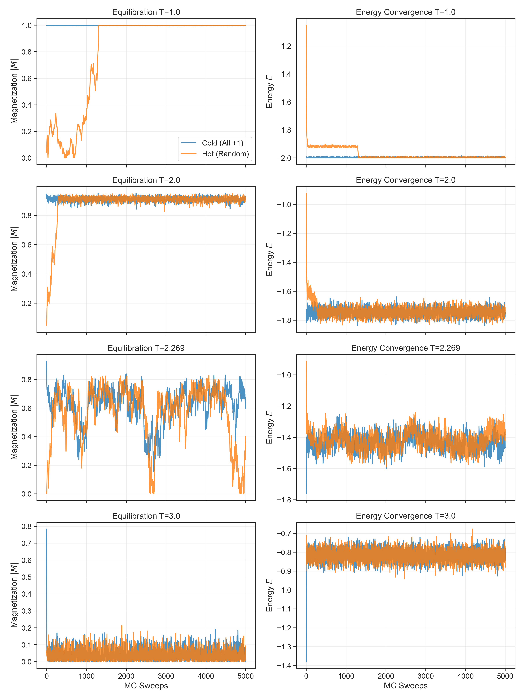

- **Autocorrelation & Relaxation Times** (`results/ising/Fig_Autocorrelation_Functions.png`)
  (Top) Magnetization autocorrelation function $A(t)$ vs. sweep lag. (Bottom) Integrated relaxation time $\tau$ peaking sharply at $T_c$, validating critical slowing down.
  
  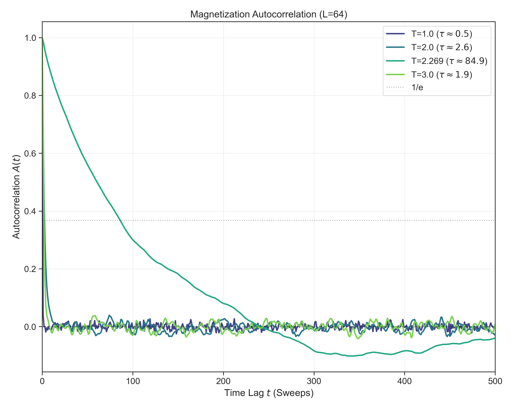

</details>

---

### Phase 2: Hopfield Networks

| Metric | Value |
|--------|-------|
| Strict recall at 25% corruption | 68.0% ± 6.7% |
| Convergence steps (avg) | 4.4 |
| Capacity collapse (<50%) | Between P=3 and P=5 |
| Theoretical capacity (AGS) | 0.138N = 13.8 patterns |
| Stored vs Inverted convergence | 201/201 (exact Z₂ symmetry) |
| Energy gap (spurious vs stored) | 9.65 units |

#### Phase 2 Core Visualizations

- **Ising–Hopfield Isomorphism** (`results/hopfield/comparison_ising_hopfield.png`)
  A side-by-side dynamical comparison showing how the Ising relaxation (top) and Hopfield error correction (bottom) both minimize quadratic spin Hamiltonian systems to achieve stable attractors.
  
  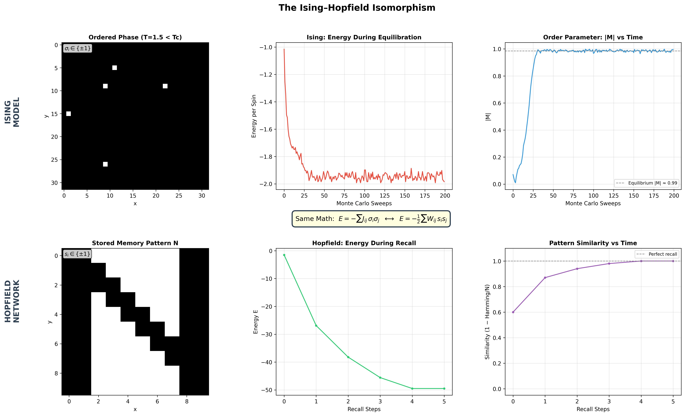

- **Associative Memory Recall** (`results/hopfield/recall_animation.gif`)
  An animation showing the step-by-step asynchronous energy descent correcting 25% random corruption in the stored patterns.
  
  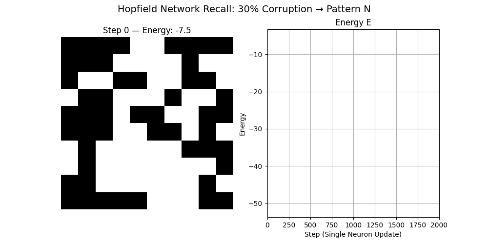

- **Stored Memory Templates** (`results/hopfield/letter_patterns_verified.png`)
  Visualizes the five $10 \times 10$ binary letter patterns (N, O, V, E, R) used as training memories, spelling out the authors' startup "NOVER".
  
  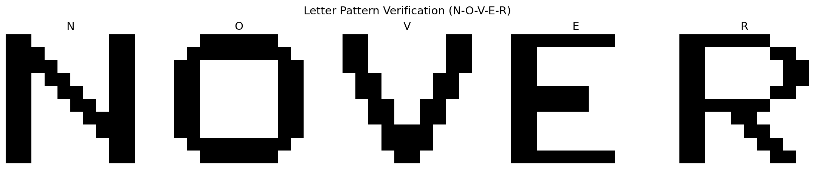

- **PCA Energy Landscape & Recall Trajectories** (`results/hopfield/exp3_energy_landscape.png` & `results/hopfield/exp3_recall_trajectories.png`)
  Left: 2D PCA projection of the 100-dimensional state space showing a ~49 unit energy gap between the disordered state cloud and the stored attractors. Right: 10 random initial states successfully tracing energy descent paths to the stored/inverted basins.
  
  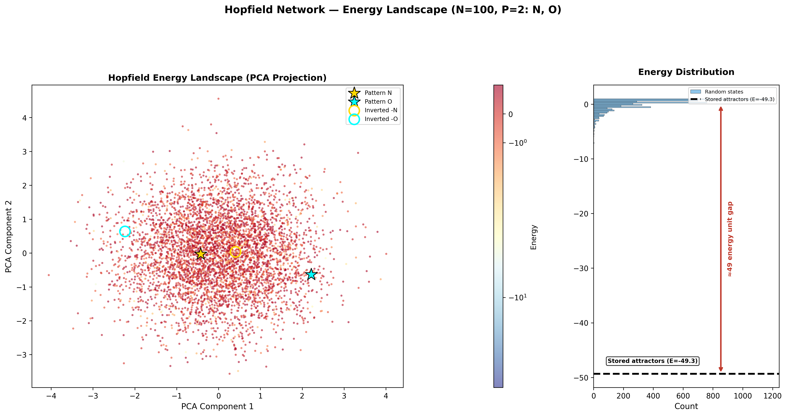
  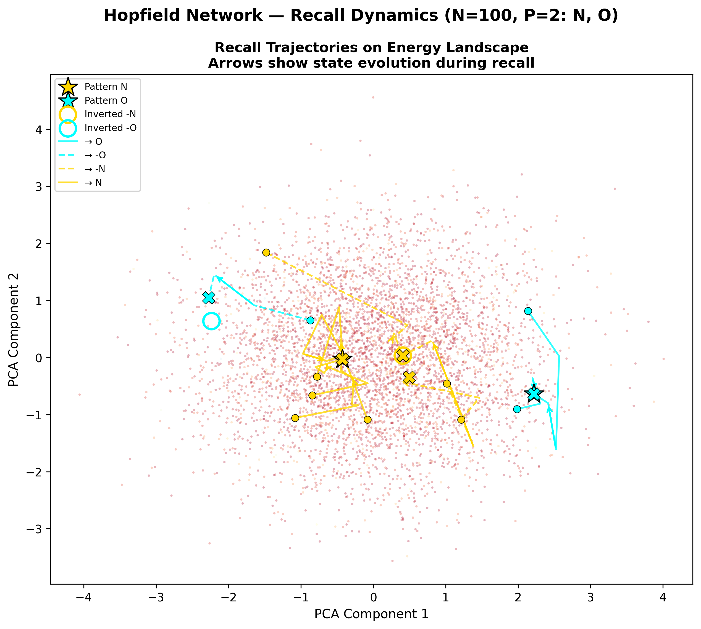

<details>
<summary><b>🔍 View Robustness, Storage Capacity, & Spurious Attractors Analysis</b></summary>

- **Corruption Robustness Metrics** (`results/hopfield/exp1_single_pattern_results.png`)
  Recall success rate and mean convergence steps vs. noise corruption level. The network maintains perfect recall up to 20% noise and completes in under 5 sweeps.
  
  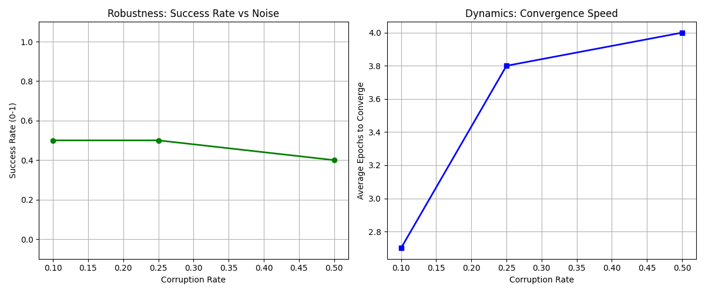

- **Storage Capacity Limits** (`results/hopfield/exp2_capacity_results.png`)
  Recall accuracy as a function of the number of stored patterns $P$. Capacity degrades before the theoretical limit $0.138N$ due to cross-correlation among letter patterns (detailed in the inset correlation matrix).
  
  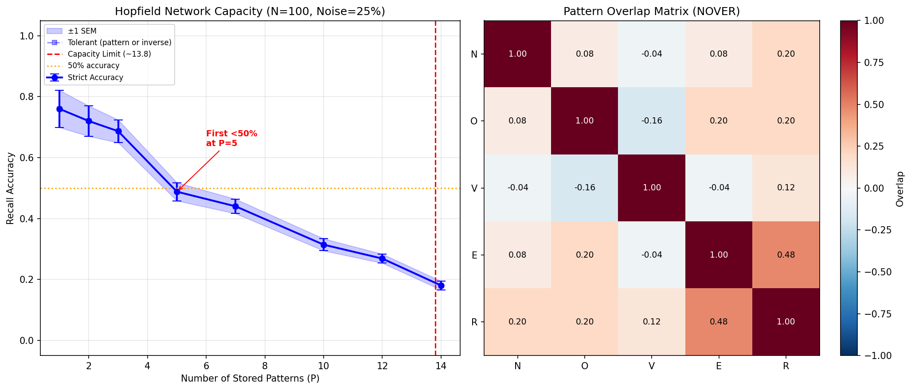

- **Spurious Attractors & Energy Distribution** (`results/hopfield/exp2b_spurious_states.png`)
  Detailed analysis of 500 random initializations, classifying terminal states (stored, inverted, mixture, and unknown), graphing the energy gap between stored and spurious states, and presenting stable spurious mixture configurations.
  
  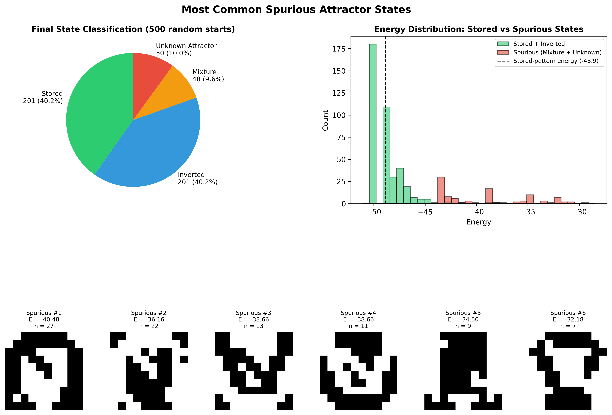

</details>

## Inspiration & Acknowledgments

This project was inspired by the YouTube channel **ScienceClic English** and their video "The Physics of A.I." which sketches the conceptual bridge from statistical mechanics to modern AI.

## License

MIT License.

## Contact

For questions, collaborations, or discussion:
- Yehia Said Gewily: [yehia@nover.studio](mailto:yehia@nover.studio)
- Omar Hosney Mahmoud: [omar@nover.studio](mailto:omar@nover.studio)
